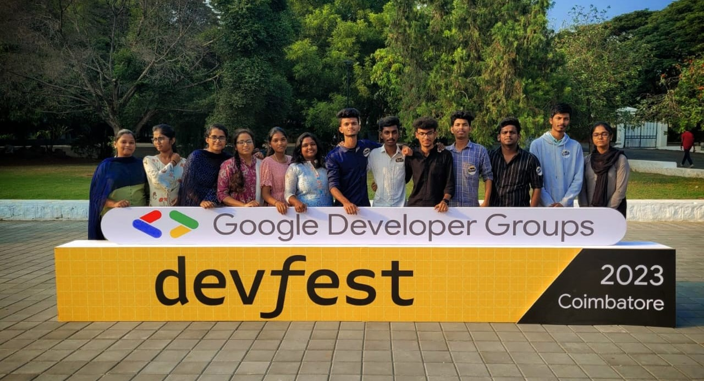

<h1 align="center">Squad of Creators 🚀</h1>

  

  Welcome to <strong>Squad of Creators</strong>! We are a team of 10-12 ambitious final-year B.Tech AI & DS students, driven by a passion for innovation and excellence. Our expertise spans across a wide range of services including Artificial Intelligence, Machine Learning, Data Science, Deep Learning, Web Development, Poster Designing, and UI Designing.

<h2>🌟 Our Mission</h2>

  At <strong>Squad of Creators</strong>, we strive to blend innovation with excellence. Our mission is to deliver top-notch solutions that drive success and empower our clients to achieve their goals.

<h2>🌐 Services We Offer</h2>

<h3>Artificial Intelligence & Machine Learning Model Development 🤖</h3>
<ul>
  <li>Predictive Analytics</li>
  <li>Natural Language Processing</li>
  <li>Computer Vision</li>
  <li>Custom AI Solutions</li>
</ul>

<table style="width: 100%; table-layout: fixed;">
      <tr align="center">
        <th>Tensorflow</th>
        <th>Keras</th>
        <th>Numpy</th>
        <th>Pandas</th>
        <th>Matplotlib</th>
        <th>MySQL</th>
        <th>LLMs</th>
      </tr>
      <tr align="center">
        <td></td>
        <td></td>
        <td></td>
        <td></td>
        <td></td>
        <td></td>
        <td></td>
      </tr>
    </table>

<h3>UI/UX Designs 🎨</h3>
<ul>
  <li>Creative Poster Designs</li>
  <li>User Interface Design</li>
  <li>Branding & Identity</li>
  <li>Graphic Design</li>
</ul>

<table style="width: 100%; table-layout: fixed;">
      <tr align="center">
        <th>Figma</th>
        <th>Adobe Illustrator</th>
        <th>Adobe Photoshop</th>
        <th>Canva</th>
      </tr>
      <tr align="center">
        <td>
          
        </td>
        <td>
          
        </td>
        <td>
          
        </td>
        <td>
          
        </td>
       </tr>
</table>

<h3>Web Development 🌐</h3>
<ul>
  <li>Frontend & Backend Development</li>
  <li>Responsive Design</li>
  <li>E-commerce Solutions</li>
  <li>Web Applications</li>
</ul>

<table style="width: 100%; table-layout: fixed;">
      <tr align="center">
        <th>HTML</th>
        <th>CSS3</th>
        <th>Bootstrap</th>
        <th>JavaScript</th>
        <th>ReactJS</th>
        <th>Figma</th>
        <th>Canva</th>
      </tr>
      <tr align="center">
        <td></td>
        <td></td>
        <td></td>
        <td></td>
        <td></td>
        <td></td>
        <td></td>
      </tr>
    </table>

<h2>📫 Contact Us</h2>

<ul>
  <li><strong>Email:</strong> <a href="mailto:squadofcreators@gmail.com">squadofcreators@gmail.com</a></li>
  <li><strong>Address:</strong> Coimbatore, Tamil Nadu, India</li>
</ul>

<h2>🌍 Connect With Us</h2>

Stay updated with our latest projects and insights:

<ul>
  <li><a href="https://www.linkedin.com">LinkedIn</a></li>
  <li><a href="https://twitter.com">Twitter</a></li>
  <li><a href="https://instagram.com">Instagram</a></li>
</ul>

  

  We believe in the power of creativity and technology to transform the world. Join us on our journey to make a difference!

